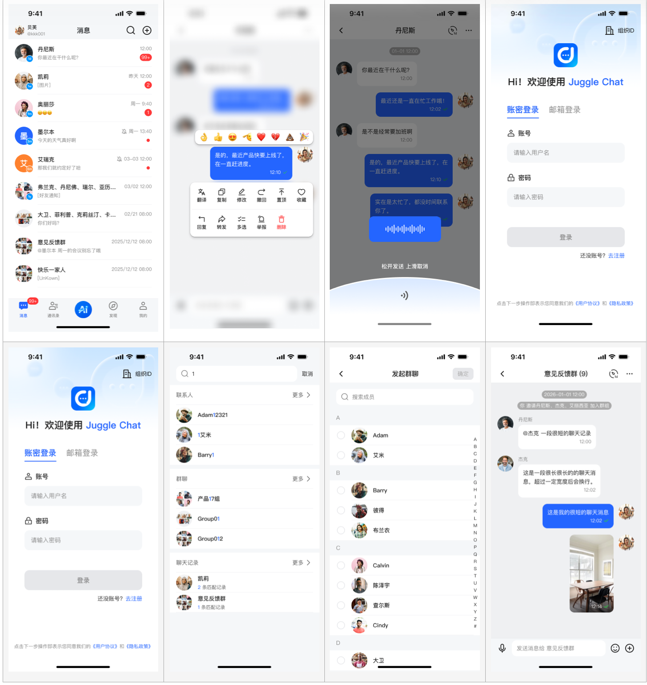
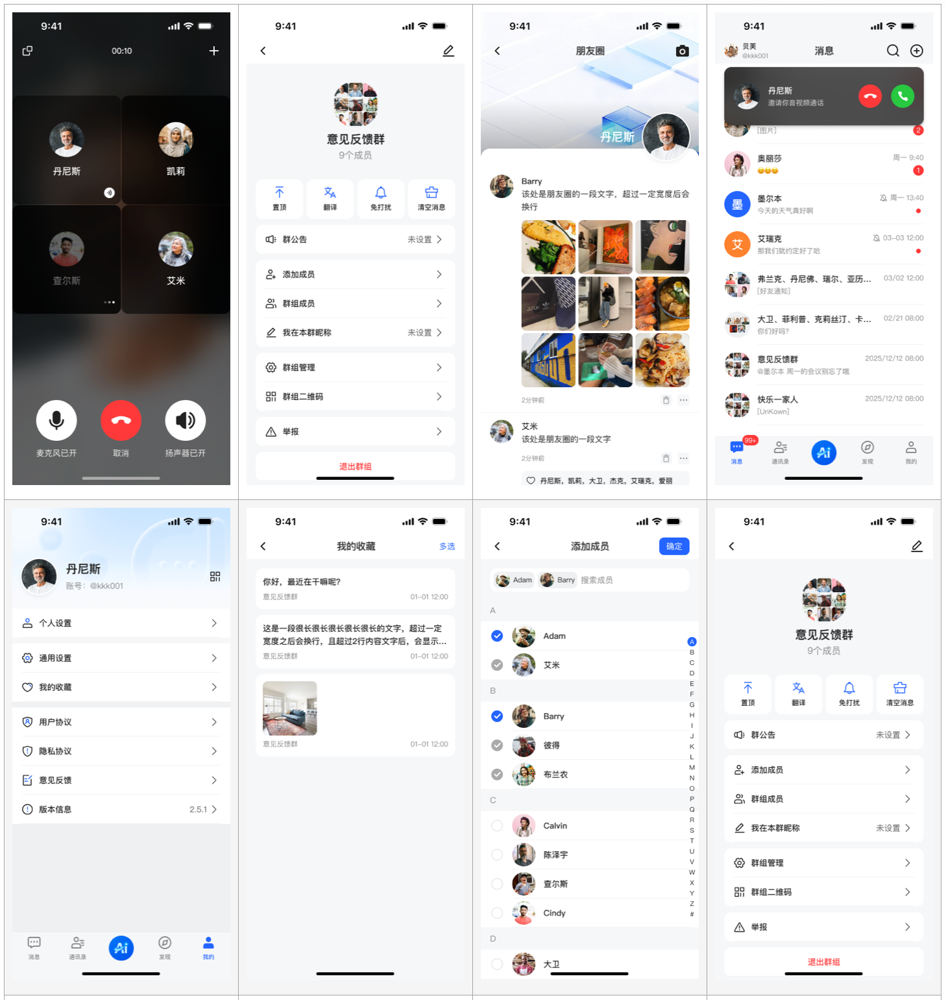

# JuggleChat Android

一个可直接运行的 Android IM 示例工程：基于 JuggleIM SDK + ZEGO 音视频，覆盖从登录到聊天、群组、朋友圈、通话的完整链路。

## 为什么看这个项目

- 想快速评估 JuggleIM Android 接入成本
- 想拿到一个可运行、可改造的 IM Demo 作为业务原型
- 想参考聊天、会话、消息、通话在 Android 端的落地方式

## 功能总览

- 账号体系：登录、注册、会话恢复、多端登录态处理
- 会话体系：会话列表、分页、未读数、置顶、免打扰
- 消息体系：文本、图片、语音、文件、合并消息、消息回应
- 通讯录与群组：好友管理、群管理、群公告、群成员管理
- 发现页：朋友圈发布、评论、点赞
- 搜索：好友/群组/消息检索
- 实时通话：单聊与多人音视频、来电浮窗

## 界面预览

## 技术信息（快速判断用）

| 项目 | 当前配置 |
|---|---|
| 平台 | Android（Java） |
| 最低/目标 SDK | 24 / 34 |
| Android Gradle Plugin | 8.4.0 |
| Gradle Wrapper | 8.6 |
| 核心 IM | `com.juggle.im:juggle:1.8.44` |
| 音视频 | `com.juggle.call.zego:juggle:1.8.25` + `im.zego:express-video:3.17.3` |
| 关键基础库 | Retrofit、EventBus、Glide、CameraX、ML Kit |

## 工程结构

主要代码目录：`app/src/main/java/com/juggle/im/android/`

- `app/`：应用壳层与主页面（登录、设置、个人中心等）
- `auth/`：会话持久化、鉴权保护、启动路由
- `chat/`：聊天核心（会话、消息、群组、搜索、通话、朋友圈）
- `core/`：IM SDK 核心封装（`JIMChatCore`）
- `server/`：HTTP 接口调用与数据对象
- `event/`：EventBus 事件定义
- `service/`：前台服务与保活
- `utils/` / `widget/`：工具类与自定义组件

详细拆解可查看 `docs/project-modules.md`。

## 3 分钟上手

### 1. 准备环境

- Android Studio（建议最新稳定版）
- JDK 17
- Android SDK 34

### 2. 配置运行参数

先修改 `app/src/main/java/com/juggle/im/android/model/ConfigUtils.java` 中的关键值：

- `appKey`：JuggleIM 应用 Key
- `appServerUrl` / `imServer`：业务服务地址与 IM 地址
- `zegoId`：ZEGO 音视频 AppID

### 3. 构建并运行

- IDE 方式：Android Studio 直接运行 `app` 模块
- 命令行方式：执行 `./gradlew :app:assembleDebug`

## 常用开发命令

| 命令 | 用途 |
|---|---|
| `./gradlew :app:assembleDebug` | 构建 Debug 包 |
| `./gradlew :app:assembleRelease` | 构建 Release 包 |
| `./gradlew :app:testDebugUnitTest` | 运行单元测试 |
| `./gradlew :app:lintDebug` | 运行 Lint |
| `bash scripts/ci/check-quality.sh` | 本地执行 CI 质量门禁流程 |

## CI 说明

- 工作流文件：`.github/workflows/android-ci.yml`
- 质量脚本：`scripts/ci/check-quality.sh`

注意：脚本当前包含 `./gradlew verifyModuleBoundaries`，但工程内暂未定义该任务；直接执行脚本会在该步骤失败。若你准备在仓库中启用该脚本，建议先补充该任务或调整脚本门禁项。

## 关键权限与发布注意

- 已声明常用 IM 权限：通知、相机、麦克风、媒体读取、前台服务等
- 仓库中的 `keystore/key.keystore` 及签名口令仅用于示例调试，不可用于生产
- 发布前请替换正式服务地址、密钥与签名配置

## 开源与使用说明

本项目主要用于学习、评估与二次开发参考。
如用于商业场景，请自行评估并处理：

- SDK 商业授权
- 服务端与密钥安全
- 隐私合规与数据合规

